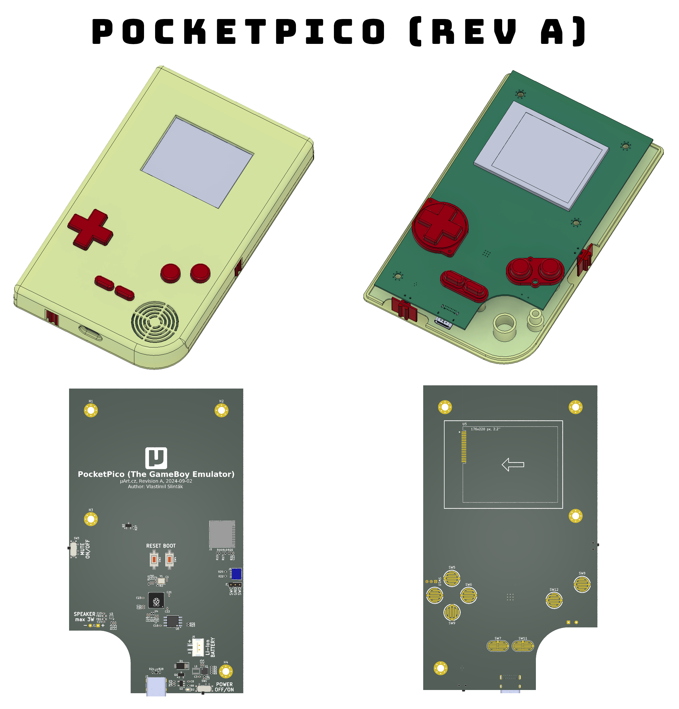

# PocketPico (The GameBoy Emulator for RP2040)

This is a fork of the [Pico-GB GameBoy emulator for RP2040 from YouMakeTech](https://github.com/YouMakeTech/Pico-GB) which itself is a fork of the [RP2040-GB Game Boy (DMG) emulator from deltabeard](https://github.com/deltabeard/RP2040-GB).

PocketPico is a Game Boy (DMG) emulator Peanut-GB on the custom PCB with Raspberry Pi RP2040 microcontroller, using an ILI9225 screen. Runs at 55-60 fps with audio and more than 70 fps without audio emulation. With frame skip and interlacing, can run at up to 120 fps.

The [YouMakeTech fork](https://github.com/YouMakeTech/Pico-GB) includes these changes:
* push buttons support
* overclocking to 266MHz for more accurate framerate (~60 FPS)
* I2S sound support (44.1kHz 16 bits stereo audio)
* SD card support (store roms and save games) + game selection menu
* automatic color palette selection for some games (emulation of Game Boy Color Bootstrap ROM) + manual color palette selection

I made these changes:
* include `pico-sdk`, `peanut-gb`, `minigb_apu` and `hedley` as Git submodules
* use latest versions (from master branch) of the `peanut-gb` and `minigb_apu`
* use 32.768 kHz sample rate for audio (default value for latest `minigb_apu`)
* drawing to LCD is offloaded to DMA and PIO, second MCU core is no longer needed
* moved audio processing to the second MCU core

# Hardware

**More informations soon!**




# Flashing the firmware

* Download `PocketPico.uf2` from the [releases page](https://github.com/slintak/PocketPico/releases)
* Connect the PocketPico to your computer by USB-C cable. Turn on the device.
* Push and hold the `1` button on the PocketPico located at the back (this is `BOOTSEL` button).
* Press and release the `2` button on the PocketPico located next to the `1` button (this is `RESET` button). You can release all button, now.
* The drive RPI-RP2 should appear on your computer as a new removable disk.
* Drag and drop the UF2 file on to the RPI-RP2 drive. The PocketPico will reboot and will now run the emulator.

# Preparing the SD card

The micro SD card is used to store game roms and save game progress. For this project, you will need a FAT 32 formatted micro SD card with roms you legally own. Roms must have the .gb extension.

* Insert your micro SD card in a computer and format it as FAT 32
* Copy your .gb files to the SD card root folder (subfolders are not supported at this time)
* Insert the SD card into the micro SD card slot using a Micro SD adapter

# Building from source

Make sure your system has git, cmake and pyOCD (requires working Python3 installation):

```
$ sudo apt-get install git cmake
$ python3 -m pip install -U pyocd
```

Clone this repository and all its submodules:

```
$ git clone https://github.com/slintak/PocketPico.git
$ git submodules update --init --recursive
```

Build source code

```
$ make configure
$ make build
```

The firmware is located in `./build/PocketPico.bin` and `./build/PocketPico.uf2`. Flashing firmware during the development requires [Raspberry Pi Debug Probe](https://www.raspberrypi.com/products/debug-probe/).

```
$ pyocd flash -t rp2040 ./build/PocketPico.bin
```

# Known issues and limitations

* No copyrighted games are included with PocketPico / Pico-GB / RP2040-GB. For this project, you will need a FAT 32 formatted Micro SD card with roms you legally own. Roms must have the .gb extension.
* The PocketPico / Pico-GB emulator is able to run at full speed on the Pico, at the expense of emulation accuracy. Some games may not work as expected or may not work at all. RP2040-GB is still experimental and not all features are guaranteed to work.
* PocketPico is only compatible with original Game Boy DMG games (not compatible with Game Boy Color or Game Boy Advance games).
* The emulator overclocks the Pico in order to get the emulator working fast enough. Overclocking can reduce the Pico’s lifespan.
